# DigiDollar TestNet Beginner's Guide
**Complete Guide to Compiling, Running, Mining, and Testing DigiDollar v9.26**

**Version:** 1.0
**Date:** 2025-11-24
**Status:** Production-Ready
**Difficulty:** Beginner-Friendly

---

## Table of Contents

### Part I: Getting Started
1. [Introduction](#1-introduction)
2. [System Requirements](#2-system-requirements)
3. [Quick Start Summary](#3-quick-start-summary)

### Part II: Compilation & Setup
4. [Compiling the QT Wallet](#4-compiling-the-qt-wallet)
5. [Configuration Files](#5-configuration-files)
6. [Starting TestNet](#6-starting-testnet)

### Part III: Mining & Activation
7. [Mining on TestNet](#7-mining-on-testnet)
8. [Reaching DigiDollar Activation](#8-reaching-digidollar-activation)
9. [Understanding the Oracle System](#9-understanding-the-oracle-system)

### Part IV: DigiDollar Operations
10. [Minting Your First DigiDollars](#10-minting-your-first-digidollars)
11. [Sending DigiDollars](#11-sending-digidollars)
12. [Receiving DigiDollars](#12-receiving-digidollars)
13. [Redeeming from the Vault](#13-redeeming-from-the-vault)

### Part V: Advanced Topics
14. [Using the QT GUI Wallet](#14-using-the-qt-gui-wallet)
15. [Command Line Reference](#15-command-line-reference)
16. [Troubleshooting](#16-troubleshooting)
17. [Additional Resources](#17-additional-resources)

---

# Part I: Getting Started

## 1. Introduction

### What is DigiDollar?

DigiDollar is the **world's first truly decentralized stablecoin** built natively on a UTXO blockchain (DigiByte). Unlike traditional stablecoins controlled by companies like Tether or Circle, DigiDollar:

✅ **You Keep Control** - Everything happens in your DigiByte Core wallet
✅ **Truly Decentralized** - No company or bank controls it
✅ **Backed by DGB** - Uses DigiByte as collateral (strategic reserve asset)
✅ **Always Worth $1 USD** - Stable and predictable value
✅ **Fast Transactions** - 15-second blocks, instant settlement

### How Does DigiDollar Work? (Simple Explanation)

Think of it like a **silver safe in your basement**:

1. You have $1,000 worth of silver (DGB)
2. Instead of selling it, you lock it in a time-locked safe in YOUR basement
3. The safe gives you $500 cash (DigiDollars) to spend today
4. The silver NEVER leaves your possession - it stays in YOUR safe
5. 10 years later, your silver is worth $10,000!
6. To unlock: Return the $500 → Get your $10,000 silver back
7. **You kept ALL the appreciation**

That's EXACTLY how DigiDollar works:
- ✅ Lock DGB in YOUR wallet (never leaves your control)
- ✅ Get DigiDollars to spend today
- ✅ Keep your private keys the entire time
- ✅ Redeem later and get ALL the DGB appreciation

### What Will You Learn?

By the end of this guide, you will be able to:

1. ✅ Compile the DigiByte QT wallet from source code
2. ✅ Run a TestNet node and mine blocks
3. ✅ Mint DigiDollars by locking DGB collateral
4. ✅ Send and receive DigiDollars to other addresses
5. ✅ Redeem DigiDollars and unlock your DGB
6. ✅ Understand how the Oracle price system works
7. ✅ Use both the graphical wallet (QT) and command line

---

## 2. System Requirements

### Minimum Requirements

| Component | Requirement | Notes |
|-----------|-------------|-------|
| **OS** | Linux, macOS, or Windows | Ubuntu 22.04+ recommended |
| **RAM** | 16 GB minimum | Compilation requires significant memory |
| **Disk Space** | 50 GB free | For TestNet blockchain + build + dependencies |
| **CPU** | 4 cores | 8+ cores recommended for faster builds |
| **Internet** | Broadband | For downloading blockchain and dependencies |

### Software Prerequisites

**Linux (Ubuntu/Debian):**
```bash
sudo apt-get install build-essential libtool autotools-dev automake \
    pkg-config bsdmainutils python3 git
```

**macOS:**
```bash
# Install Xcode Command Line Tools
xcode-select --install

# Install Homebrew
/bin/bash -c "$(curl -fsSL https://raw.githubusercontent.com/Homebrew/install/HEAD/install.sh)"

# Install dependencies
brew install automake libtool boost pkg-config libevent
```

**Windows:**
- Download Visual Studio 2022 (Community Edition is free)
- OR use WSL2 (Windows Subsystem for Linux) with Ubuntu

---

## 3. Quick Start Summary

### The Complete DigiDollar Testing Journey

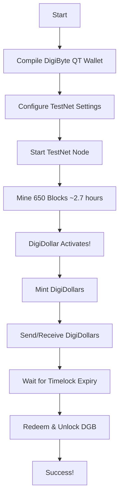

### Time Commitment

| Phase | Time Required | Can Run Unattended? |
|-------|--------------|---------------------|
| Compilation | 10-30 minutes | No (initial setup) |
| TestNet Sync | 5-10 minutes | Yes |
| Mining to Activation | ~2.7 hours | Yes (automated) |
| Testing DigiDollar | 30-60 minutes | No (interactive) |
| **Total** | **3-4 hours** | Mostly automated |

### What You'll Need

- [ ] Computer with Linux, macOS, or Windows
- [ ] 10 GB free disk space
- [ ] Internet connection
- [ ] 3-4 hours of time (mostly automated)
- [ ] This guide open in a browser 😊

**Let's get started!**

---

# Part II: Compilation & Setup

## 4. Compiling the QT Wallet

### Complete Build Flow Diagram

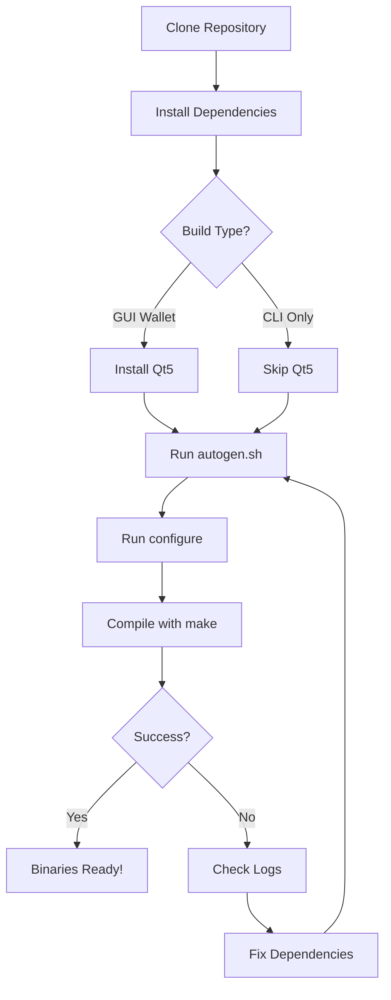

### Step-by-Step Compilation

#### Step 1: Clone the Repository

```bash
# Create a workspace directory
mkdir -p ~/Code
cd ~/Code

# Clone DigiByte repository
git clone https://github.com/digibyte-core/digibyte.git
cd digibyte

# Checkout the feature/digidollar-v1 branch
git checkout feature/digidollar-v1

# Verify you're on the right branch
git branch
# Should show: * feature/digidollar-v1
```

#### Step 2: Install Build Dependencies

<details>
<summary><b>🐧 Linux (Ubuntu/Debian) - Click to Expand</b></summary>

```bash
# Update package manager
sudo apt-get update
sudo apt-get upgrade

# Install build essentials
sudo apt-get install -y build-essential libtool autotools-dev automake \
    pkg-config bsdmainutils python3 git

# Install required libraries
sudo apt-get install -y libevent-dev libboost-dev libsqlite3-dev

# For GUI wallet (Qt5)
sudo apt-get install -y qtbase5-dev qttools5-dev qttools5-dev-tools qtwayland5

# Optional: QR code support in GUI
sudo apt-get install -y libqrencode-dev

# Optional: Network features
sudo apt-get install -y libminiupnpc-dev libnatpmp-dev

# Optional: ZMQ support
sudo apt-get install -y libzmq3-dev

# Optional: USDT tracing
sudo apt-get install -y systemtap-sdt-dev
```

</details>

<details>
<summary><b>🍎 macOS - Click to Expand</b></summary>

```bash
# Install Xcode Command Line Tools (if not already installed)
xcode-select --install

# Install Homebrew (if not already installed)
/bin/bash -c "$(curl -fsSL https://raw.githubusercontent.com/Homebrew/install/HEAD/install.sh)"

# Install build dependencies
brew install automake libtool boost pkg-config libevent

# For GUI wallet
brew install qt@5

# Optional: QR code support
brew install qrencode

# Optional: Network features
brew install miniupnpc libnatpmp

# Optional: ZMQ support
brew install zeromq
```

</details>

<details>
<summary><b>🪟 Windows (WSL2 with Ubuntu) - Click to Expand</b></summary>

**Option 1: Use WSL2 (Recommended for Beginners)**

```bash
# Install WSL2 from PowerShell (as Administrator)
wsl --install -d Ubuntu-22.04

# Once Ubuntu is installed, follow the Linux instructions above
```

**Option 2: Native Windows Build (Advanced)**

Requires Visual Studio 2022. See the full guide in:
`/home/jared/Code/digibyte/doc/build-windows.md`

</details>

#### Step 3: Generate Build Configuration

```bash
cd ~/Code/digibyte

# Generate configure script
./autogen.sh
```

**Expected Output:**
```
libtoolize: putting auxiliary files in AC_CONFIG_AUX_DIR, 'build-aux'.
libtoolize: copying file 'build-aux/ltmain.sh'
...
configure.ac:59: installing 'build-aux/compile'
configure.ac:32: installing 'build-aux/config.guess'
```

#### Step 4: Configure the Build

**Option A: Full Build (GUI + Wallet)**

```bash
./configure --with-gui=yes
```

**Option B: CLI Only (No GUI)**

```bash
./configure --with-gui=no
```

**Option C: Memory-Constrained Systems**

```bash
./configure CXXFLAGS="--param ggc-min-expand=1 --param ggc-min-heapsize=32768"
```

**Configuration Output:**
```
checking for boostlib >= 1.64.0 (106400)... yes
checking for libevent >= 2.1.8... yes
checking for Qt5Core >= 5.11.3... yes
...
Options used to compile and link:
  with wallet   = yes
  with gui / qt = yes
  with zmq      = yes
```

#### Step 5: Compile the Code

```bash
# Compile using all CPU cores
make -j$(nproc)

# This takes 10-30 minutes depending on your system
```

**Progress Indicator:**
```
  CXX      libdigibyte_server_a-addrdb.o
  CXX      libdigibyte_server_a-addrman.o
  CXX      digidollar/digidollar.o
  CXX      digidollar/txbuilder.o
  ...
  CXXLD    digibyted
  CXXLD    digibyte-cli
  CXXLD    digibyte-qt
```

#### Step 6: Verify the Build

```bash
# Check that executables were created
ls -lh src/digibyted src/digibyte-cli src/qt/digibyte-qt

# Test daemon version
./src/digibyted --version

# Test CLI version
./src/digibyte-cli --version

# Test GUI (if built)
./src/qt/digibyte-qt --version
```

**Expected Output:**
```
DigiByte Core version v9.26.0
Copyright (C) 2014-2025 The DigiByte Core developers
```

#### Step 7: Optional - Install System-Wide

```bash
# Install to /usr/local/bin (requires sudo)
sudo make install

# Now you can run from anywhere
digibyted --version
digibyte-cli --version
digibyte-qt --version
```

---

### Compilation Troubleshooting

<details>
<summary><b>⚠️ Error: "configure: error: libdb_cxx headers missing"</b></summary>

**Solution:** Berkeley DB is not required for DigiDollar (uses SQLite).

```bash
./configure --without-bdb --with-gui=yes
```

</details>

<details>
<summary><b>⚠️ Error: "Qt not found"</b></summary>

**Solution:** Install Qt5 development packages.

**Linux:**
```bash
sudo apt-get install qtbase5-dev qttools5-dev qttools5-dev-tools
```

**macOS:**
```bash
brew install qt@5
export PATH="/opt/homebrew/opt/qt@5/bin:$PATH"
```

Or build without GUI:
```bash
./configure --with-gui=no
```

</details>

<details>
<summary><b>⚠️ Error: "Boost not found"</b></summary>

**Solution:** Install Boost development libraries.

**Linux:**
```bash
sudo apt-get install libboost-all-dev
```

**macOS:**
```bash
brew install boost
```

</details>

<details>
<summary><b>⚠️ Error: "virtual memory exhausted" during compilation</b></summary>

**Solution:** Reduce parallel jobs or add swap space.

```bash
# Use fewer parallel jobs
make -j2

# Or add swap space (Linux)
sudo fallocate -l 4G /swapfile
sudo chmod 600 /swapfile
sudo mkswap /swapfile
sudo swapon /swapfile
```

</details>

---

## 5. Configuration Files

### Creating digibyte.conf

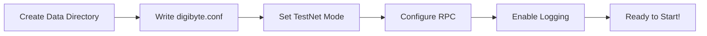

#### Step 1: Create Data Directory

**Linux:**
```bash
mkdir -p ~/.digibyte
```

**macOS:**
```bash
mkdir -p ~/Library/Application\ Support/DigiByte
```

**Windows:**
```powershell
mkdir %APPDATA%\DigiByte
```

#### Step 2: Create digibyte.conf File

**Linux/macOS:**
```bash
cat > ~/.digibyte/digibyte.conf << 'EOF'
#########################################
# DigiByte TestNet Configuration
# DigiDollar Testing Guide v1.0
#########################################

# Network Settings
testnet=1                    # Enable TestNet mode
server=1                     # Enable RPC server
daemon=1                     # Run as daemon (background)

# RPC Configuration
rpcuser=digidollar_tester   # Change this!
rpcpassword=secure_password_here  # CHANGE THIS!
rpcallowip=127.0.0.1        # Allow local connections
rpcallowip=::1              # Allow IPv6 localhost
rpcport=14026               # RC44 testnet26 RPC port (default)

# Node Settings
listen=1                     # Accept incoming connections
discover=1                   # Discover network peers
dns=1                        # Use DNS seeds
txindex=1                    # Index all transactions (needed for DigiDollar)

# Performance
dbcache=512                  # Database cache (MB)
maxconnections=125           # Max peer connections

# Mining (for testing)
miningalgo=scrypt           # Default mining algorithm

# Logging - IMPORTANT for DigiDollar testing!
debug=digidollar            # Enable DigiDollar debug logs
debug=oracle                # Enable Oracle debug logs
logips=1                    # Log peer IP addresses

# DigiDollar Specific
# (No special config needed - activates at block 600 on testnet26)

EOF
```

**⚠️ IMPORTANT:** Change the `rpcpassword` to something secure!

#### Step 3: Verify Configuration

```bash
# Linux/macOS
cat ~/.digibyte/digibyte.conf

# Check that testnet=1 is set
grep testnet ~/.digibyte/digibyte.conf
```

---

## 6. Starting TestNet

### TestNet Architecture Overview

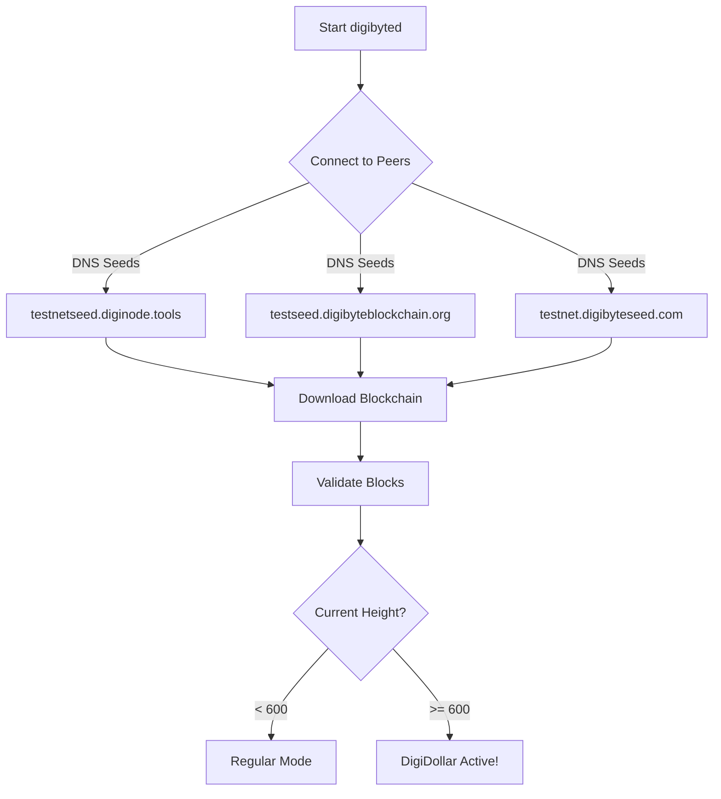

### Starting the Daemon (Command Line)

#### Method 1: Background Daemon

```bash
# Start TestNet daemon
./src/digibyted -testnet -daemon

# Wait a few seconds for startup
sleep 5

# Verify it's running
./src/digibyte-cli -testnet getblockchaininfo
```

**Expected Output:**
```json
{
  "chain": "test",
  "blocks": 0,
  "headers": 0,
  "bestblockhash": "b1bde539fa2e0f45837a6639ea3f384ce5440a7f3e41eaeea8add9f86a28301a",
  "difficulty": 0.000244140625,
  "time": 1763932527,
  "mediantime": 1763932527,
  "verificationprogress": 1,
  "initialblockdownload": false,
  "chainwork": "0000000000000000000000000000000000000000000000000000000000001000",
  "size_on_disk": 293,
  "pruned": false,
  "warnings": ""
}
```

#### Method 2: Foreground (See Logs in Real-Time)

```bash
# Start in foreground with verbose logging
./src/digibyted -testnet -printtoconsole
```

**You'll see:**
```
2025-11-24T12:00:00Z DigiByte Core version v9.26.0
2025-11-24T12:00:00Z Using the 'sse4(1way),sse41(4way)' SHA256 implementation
2025-11-24T12:00:00Z Using RdSeed as additional entropy source
2025-11-24T12:00:00Z Default data directory /home/user/.digibyte
2025-11-24T12:00:00Z Config file: /home/user/.digibyte/digibyte.conf
2025-11-24T12:00:00Z GUI: RegisterShutdownBlockReason: Registered shutdown message
2025-11-24T12:00:00Z Using at most 125 automatic connections (1024 file descriptors available)
2025-11-24T12:00:00Z Using 16 MiB out of 32/2 requested for signature cache, able to store 524288 elements
2025-11-24T12:00:00Z Using 16 MiB out of 32/2 requested for script execution cache, able to store 524288 elements
2025-11-24T12:00:00Z Script verification uses 7 additional threads
2025-11-24T12:00:00Z scheduler thread start
2025-11-24T12:00:00Z HTTP: creating work queue of depth 16
2025-11-24T12:00:00Z Config options rpcuser and rpcpassword will soon be deprecated. Locally-run instances may remove rpcuser to use cookie-based auth, or may be replaced with rpcauth. Please see share/rpcauth for rpcauth auth generation.
2025-11-24T12:00:00Z HTTP: starting 4 worker threads
2025-11-24T12:00:00Z Using wallet directory /home/user/.digibyte/testnet26/wallets
2025-11-24T12:00:00Z init message: Verifying wallet(s)...
2025-11-24T12:00:00Z init message: Loading banlist...
2025-11-24T12:00:00Z init message: Starting network threads...
2025-11-24T12:00:00Z net thread start
2025-11-24T12:00:00Z addcon thread start
2025-11-24T12:00:00Z Bound to [::]:12033
2025-11-24T12:00:00Z Bound to 0.0.0.0:12033
2025-11-24T12:00:00Z init message: Done loading
2025-11-24T12:00:00Z opencon thread start
2025-11-24T12:00:00Z msghand thread start
```

Press `Ctrl+C` to stop.

### Starting the GUI Wallet (QT)

```bash
# Start TestNet GUI
./src/qt/digibyte-qt -testnet

# Or if installed system-wide
digibyte-qt -testnet
```

**What You'll See:**

1. **Splash Screen** - "DigiByte Core" loading
2. **Main Window Opens** - Shows balance, transactions
3. **Syncing Status** - Bottom-right corner shows sync progress
4. **DigiDollar Tab** - Will appear after block 600

---

### Verifying TestNet is Running

```bash
# Get basic info
./src/digibyte-cli -testnet getblockchaininfo

# Check network info
./src/digibyte-cli -testnet getnetworkinfo

# Check connected peers
./src/digibyte-cli -testnet getpeerinfo | grep addr

# Check mining info (shows all 5 algorithms)
./src/digibyte-cli -testnet getmininginfo
```

---

## 7. Mining on TestNet

### Mining Flow Diagram

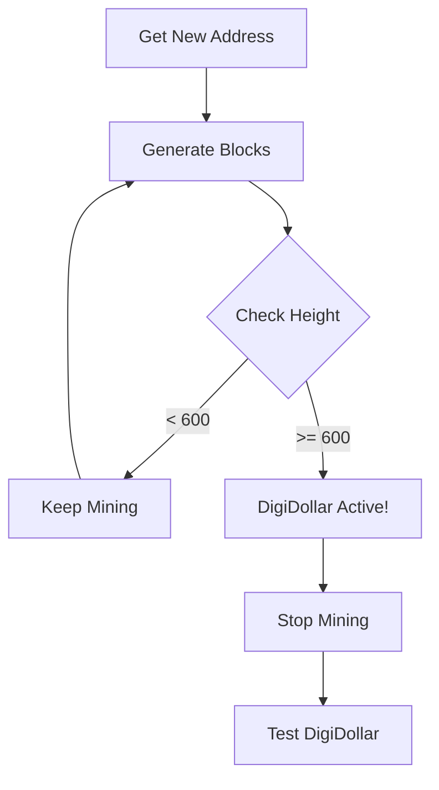

### Step-by-Step Mining Guide

#### Step 1: Create a Wallet

```bash
# Create a new wallet named "test"
./src/digibyte-cli -testnet createwallet "test"
```

**Output:**
```json
{
  "name": "test",
  "warning": ""
}
```

#### Step 2: Generate a Mining Address

```bash
# Generate new address to receive mining rewards
MINING_ADDRESS=$(./src/digibyte-cli -testnet -rpcwallet=test getnewaddress "mining")

# Display the address
echo "Your mining address: $MINING_ADDRESS"
```

**Example Output:**
```
Your mining address: dgbt1qw508d6qejxtdg4y5r3zarvary0c5xw7kv8f3t4
```

#### Step 3: Understand Mining Algorithms

DigiByte uses **5 mining algorithms** (6 after Odocrypt at block 600):

| Algorithm | ID | Description | Best For |
|-----------|----|-----------|----|
| **SHA256d** | 0 | Double SHA-256 | ASIC mining |
| **Scrypt** | 1 | Memory-hard PoW | CPU/GPU mining (DEFAULT) |
| **Groestl** | 2 | Groestl-512 | GPU mining |
| **Skein** | 3 | Skein-1024 | GPU mining |
| **Qubit** | 4 | Qubit hash | GPU mining |
| **Odocrypt** | 7 | Changeable hash (after block 600) | FPGA mining |

**For TestNet CPU mining, use `scrypt` (easiest).**

#### Step 4: Mine Blocks to DigiDollar Activation

**DigiDollar activates at block height 650.**

##### Option A: Mine All 650 Blocks at Once (Recommended)

```bash
# Mine 650 blocks using Scrypt algorithm
# This takes approximately 2.7 hours
./src/digibyte-cli -testnet generatetoaddress 650 "$MINING_ADDRESS" 1000000 "scrypt"
```

**What Happens:**
- Mining starts immediately
- Shows progress with each block hash
- Your terminal displays 650 block hashes as they're mined
- Rewards accumulate at your mining address

**Example Output:**
```json
[
  "0000000000000001234567890abcdef1234567890abcdef1234567890abcdef",
  "0000000000000002345678901bcdef0234567890bcdef0234567890bcdef01",
  ...
  "0000000000000650abcdef1234567890abcdef1234567890abcdef1234567890"
]
```

##### Option B: Mine in Batches (Monitor Progress)

```bash
# Mine in batches of 50 blocks
for i in {1..13}; do
    echo "Mining batch $i of 13..."
    ./src/digibyte-cli -testnet generatetoaddress 50 "$MINING_ADDRESS" 1000000 "scrypt"

    # Check current height
    HEIGHT=$(./src/digibyte-cli -testnet getblockcount)
    echo "Current height: $HEIGHT"

    # Check balance
    BALANCE=$(./src/digibyte-cli -testnet -rpcwallet=test getbalance)
    echo "Current balance: $BALANCE DGB"
    echo "---"
done

# Mine final 50 blocks to reach 650
./src/digibyte-cli -testnet generatetoaddress 50 "$MINING_ADDRESS" 1000000 "scrypt"
```

##### Option C: Automated Mining Script

```bash
# Create mining script
cat > mine_to_activation.sh << 'EOF'
#!/bin/bash

# Configuration
CLI="./src/digibyte-cli -testnet"
TARGET_HEIGHT=650
MINING_ADDRESS="$1"

if [ -z "$MINING_ADDRESS" ]; then
    echo "Usage: ./mine_to_activation.sh <mining_address>"
    exit 1
fi

echo "Mining to DigiDollar activation (height $TARGET_HEIGHT)..."
echo "Mining address: $MINING_ADDRESS"
echo ""

while true; do
    # Get current height
    CURRENT_HEIGHT=$($CLI getblockcount 2>/dev/null)

    if [ -z "$CURRENT_HEIGHT" ]; then
        echo "Error: Cannot connect to DigiByte daemon"
        exit 1
    fi

    if [ $CURRENT_HEIGHT -ge $TARGET_HEIGHT ]; then
        echo "✅ Reached DigiDollar activation at height $CURRENT_HEIGHT!"
        break
    fi

    # Calculate remaining blocks
    REMAINING=$((TARGET_HEIGHT - CURRENT_HEIGHT))

    # Mine in batches of 10
    BATCH_SIZE=10
    if [ $REMAINING -lt $BATCH_SIZE ]; then
        BATCH_SIZE=$REMAINING
    fi

    echo "Height: $CURRENT_HEIGHT | Remaining: $REMAINING | Mining $BATCH_SIZE blocks..."

    # Mine batch
    $CLI generatetoaddress $BATCH_SIZE "$MINING_ADDRESS" 1000000 "scrypt" > /dev/null

    # Show balance
    BALANCE=$($CLI -rpcwallet=test getbalance)
    echo "Balance: $BALANCE DGB"
    echo "---"

    sleep 1
done

echo ""
echo "🎉 DigiDollar is now active!"
echo "Current height: $CURRENT_HEIGHT"
echo "Final balance: $($CLI -rpcwallet=test getbalance) DGB"
EOF

# Make executable
chmod +x mine_to_activation.sh

# Run script
./mine_to_activation.sh "$MINING_ADDRESS"
```

#### Step 5: Monitor Mining Progress

**In a separate terminal:**

```bash
# Watch blockchain height in real-time
watch -n 5 './src/digibyte-cli -testnet getblockcount'
```

**Or check manually:**

```bash
# Current height
./src/digibyte-cli -testnet getblockcount

# Detailed blockchain info
./src/digibyte-cli -testnet getblockchaininfo | grep -E "blocks|difficulty|chainwork"

# Your balance
./src/digibyte-cli -testnet -rpcwallet=test getbalance

# Mining info (all algorithms)
./src/digibyte-cli -testnet getmininginfo
```

#### Step 6: Verify DigiDollar Activation

Once you reach block 600:

```bash
# Check that we're past activation
./src/digibyte-cli -testnet getblockcount
# Should show: 600 or higher

# Check DigiDollar deployment status
./src/digibyte-cli -testnet getdeploymentinfo | jq '.deployments.digidollar'
```

**Expected Output:**
```json
{
  "type": "bip9",
  "bip9": {
    "status": "active",
    "start_time": 0,
    "timeout": 4294967295,
    "since": 650,
    "min_activation_height": 650,
    "statistics": {
      "period": 2016,
      "threshold": 1815,
      "elapsed": 650,
      "count": 650,
      "possible": true
    }
  },
  "active": true,
  "height": 650
}
```

**Key field:** `"active": true` means DigiDollar is ready! 🎉

---

## 8. Reaching DigiDollar Activation

### Activation Timeline

```mermaid
gantt
    title DigiDollar Activation Timeline
    dateFormat  X
    axisFormat %s

    section Genesis
    Create Testnet     :0, 1

    section BIPs
    BIP 34, 65, 66, CSV :1, 1

    section Odocrypt
    Odocrypt Activation :600, 50

    section DigiDollar
    Oracle Activation   :650, 1
    DD Activation       :650, 1

    section Testing
    Mining & Testing    :651, 100
```

### What Happens at Each Milestone?

| Block Height | What Activates | Time to Reach | Significance |
|--------------|----------------|---------------|--------------|
| **0** | Genesis Block | Immediate | TestNet reset 2025, DigiDollar timestamp |
| **1** | All BIPs (34, 65, 66, CSV) | Immediate | Core Bitcoin improvements |
| **600** | Odocrypt (6th algorithm) | ~2.5 hours | Multi-algo PoW stabilization |
| **650** | **DigiDollar + Oracle** | ~2.7 hours | 🎉 **TESTING BEGINS!** |

### Verifying Each Activation

```bash
# Check BIP activations
./src/digibyte-cli -testnet getdeploymentinfo

# Check current height
./src/digibyte-cli -testnet getblockcount

# Check if at or past DigiDollar activation
HEIGHT=$(./src/digibyte-cli -testnet getblockcount)
if [ $HEIGHT -ge 650 ]; then
    echo "✅ DigiDollar is ACTIVE!"
else
    REMAINING=$((650 - HEIGHT))
    echo "⏳ $REMAINING blocks until DigiDollar activation"
fi
```

---

## 9. Understanding the Oracle System

### Oracle Architecture Overview

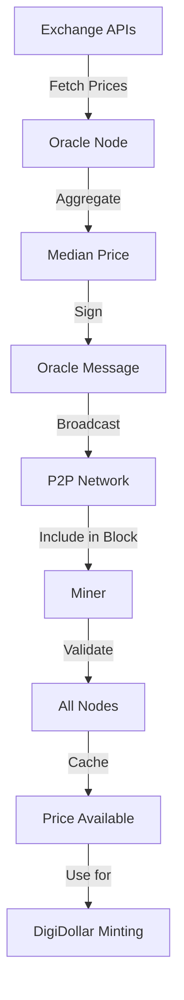

### How the Oracle Works (Simple Explanation)

Think of the Oracle as a **decentralized price reporter**:

1. **Exchange APIs** - The oracle connects to 6 active exchange sources (Binance, KuCoin, Gate.io, HTX, Crypto.com, CoinGecko)
2. **Fetch Prices** - Every 60 seconds, it fetches current DGB/USD prices
3. **Calculate Median** - Removes outliers and calculates the median price
4. **Sign Message** - Creates a cryptographically signed price message
5. **Broadcast** - Sends the message to all network nodes via P2P
6. **Block Inclusion** - Miners include the price in the coinbase transaction
7. **Validation** - All nodes verify the price data when validating blocks
8. **Caching** - The price is cached and available for DigiDollar operations

### V1 Oracle (TestNet 2026)

**Current Status:**
- ✅ **35 active oracle slots** with a 7-signature launch quorum
- ✅ **Live exchange-backed pricing** on testnet/mainnet
- ✅ **MuSig2 v0x03 bundles** in the coinbase oracle output
- ✅ **Activates at Block 600** (with DigiDollar)

Mock price RPCs are regtest-only helpers and are not a testnet/mainnet fallback.

### Checking Oracle Price

```bash
# Get current oracle price
./src/digibyte-cli -testnet getoracleprice
```

**Example Output:**
```json
{
  "price_micro_usd": 6500,
  "price_usd": 0.0065,
  "last_update_height": 650,
  "last_update_time": 1732204800,
  "validity_blocks": 240,
  "is_stale": false,
  "oracle_count": 9,
  "status": "active"
}
```

**Understanding the Output:**
- `price_micro_usd`: 6500 = $0.0065 per DGB
- `price_usd`: Human-readable format
- `last_update_height`: Block when price was last updated
- `validity_blocks`: Blocks until price is considered stale (240 = 1 hour)
- `status`: "active" = Oracle is working correctly

### Testing Oracle Price Changes (RegTest Only)

```bash
# Set mock oracle price to $0.50/DGB
./src/digibyte-cli -regtest setmockoracleprice 500000

# Set mock oracle price to $1.00/DGB
./src/digibyte-cli -regtest setmockoracleprice 1000000

# Check updated price
./src/digibyte-cli -regtest getoracleprice

# Simulate 50% price increase
./src/digibyte-cli -regtest simulatepricevolatility 50

# Simulate 20% price decrease
./src/digibyte-cli -regtest simulatepricevolatility -20
```

Do not use mock-price RPCs on testnet or mainnet. Those networks use the live
oracle feed and MuSig2 bundle path.

### Oracle Price Format (IMPORTANT!)

**Critical unit rule:** DD amounts are stored in cents, while oracle DGB/USD
prices are stored in micro-USD.

**Examples:**
| Price (USD/DGB) | Oracle micro-USD |
|-----------------|------------------|
| $0.01/DGB | 10,000 |
| $0.05/DGB | 50,000 |
| $0.10/DGB | 100,000 |
| $1.00/DGB | 1,000,000 |
| $10.00/DGB | 10,000,000 |

**Why this matters:**
- When you see `price_micro_usd: 50000`, it means $0.05 per DGB
- When minting $100 DD with price 50,000 micro-USD/DGB, base collateral is `$100 / $0.05 = 2,000 DGB`
- Then apply the canonical collateral ratio (for example, 300% = 6,000 DGB total before wallet safety margin)

---

# Part IV: DigiDollar Operations

## 10. Minting Your First DigiDollars

### Minting Flow Diagram

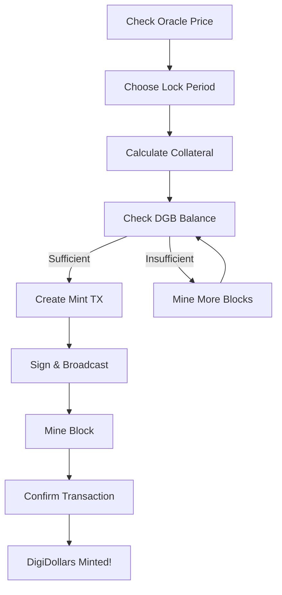

### Understanding Minting

**What is Minting?**

Minting is the process of **creating new DigiDollars by locking DGB as collateral**. Think of it as:

1. **Deposit** - You deposit DGB into a time-locked vault
2. **Issue** - The system issues DigiDollars to you (spendable immediately)
3. **Lock** - Your DGB stays locked for the chosen period
4. **Redeem** - After the period, burn DD to unlock your DGB

**Why Lock DGB?**
- Get stable currency (DigiDollars) to spend today
- Keep your DGB (it stays in your wallet, just time-locked)
- Get back ALL the DGB appreciation when you redeem
- Tax-efficient in many jurisdictions (borrowing vs selling)

### Lock Tiers and Collateral Ratios

| Lock Tier | Lock Period | Collateral Ratio | Example | Use Case |
|-----------|-------------|------------------|---------|----------|
| **0** | 1 hour | 1000% | 10x collateral | Short-term / high-volatility |
| **1** | 30 days | 500% | 5x collateral | Short-term liquidity |
| **2** | 90 days | 400% | 4x collateral | Quarterly needs |
| **3** | 180 days | 350% | 3.5x collateral | Semi-annual |
| **4** | 1 year | 300% | 3x collateral | Annual (most common) |
| **5** | 3 years | 250% | 2.5x collateral | Medium-term |
| **6** | 5 years | 225% | 2.25x collateral | Long-term |
| **7** | 7 years | 212% | 2.12x collateral | Extended |
| **8** | 10 years | 200% | 2x collateral | Maximum commitment |

**Key Insight:** Longer lock periods = Lower collateral requirements = More efficient

### Step-by-Step Minting Guide

#### Step 1: Check Your DGB Balance

```bash
# Check available DGB
./src/digibyte-cli -testnet -rpcwallet=test getbalance
```

**Example Output:**
```
4680000.00000000
```

This means you have **4,680,000 DGB** (from mining 650 blocks × 72,000 DGB/block).

#### Step 2: Check Oracle Price

```bash
# Get current DGB/USD price
./src/digibyte-cli -testnet getoracleprice
```

**Example Output:**
```json
{
  "price_micro_usd": 50000,
  "price_usd": 0.05
}
```

**Understanding:** 50,000 micro-USD = $0.05 per DGB

#### Step 3: Calculate Required Collateral

```bash
# Calculate for minting $100 with 1-year lock
./src/digibyte-cli -testnet calculatecollateralrequirement 10000 365
```

**Parameters:**
- `10000` = 10,000 cents = $100.00 DigiDollars
- `365` = 365 days (1 year lock)

**Example Output:**
```json
{
  "required_dgb": "6000.00000000",
  "minimum_required_dgb": "6000.00000000",
  "wallet_collateral_dgb": "6000.00000000",
  "collateral_safety_margin_dgb": "0.00000000",
  "dd_amount_cents": 10000,
  "dd_amount_usd": 100,
  "lock_days": 365,
  "lock_blocks": 2102400,
  "base_ratio": 300,
  "dca_multiplier": 1.0,
  "effective_ratio": 300,
  "oracle_price_micro_usd": 50000,
  "oracle_price_usd": 0.05,
  "system_health": 100,
  "dca_tier": "healthy"
}
```

**Understanding:**
- Need **6,000 DGB** minimum collateral to mint $100 DD at $0.05/DGB with a 300% ratio
- Value needed: $100 ÷ $0.05/DGB = 2,000 DGB
- With 300% collateral: 2,000 × 3 = 6,000 DGB

#### Step 4: Execute the Mint

```bash
# Mint $100 DigiDollars with 1-year lock (tier 4)
./src/digibyte-cli -testnet -rpcwallet=test mintdigidollar 10000 4
```

**Parameters:**
- `10000` = Amount in DigiDollar cents ($100.00)
- `4` = Lock tier (1 year)

**Example Output:**
```json
{
  "txid": "abcdef1234567890abcdef1234567890abcdef1234567890abcdef1234567890",
  "dd_minted": 10000,
  "dgb_collateral": 6000.00000000,
  "lock_tier": 4,
  "unlock_height": 2103050,
  "collateral_ratio": 300,
  "fee_paid": 0.001,
  "position_id": "abcdef1234567890abcdef1234567890abcdef1234567890abcdef1234567890"
}
```

**Understanding:**
- `txid`: Transaction ID (use this to track on blockchain)
- `dd_minted`: 10,000 cents = $100 DigiDollars minted
- `dgb_collateral`: 6,000 DGB locked as collateral
- `unlock_height`: Block height when you can redeem (2,103,050)
- `position_id`: Unique ID for this vault position

#### Step 5: Confirm the Transaction

```bash
# Mine a block to confirm (RegTest/TestNet testing)
./src/digibyte-cli -testnet generatetoaddress 6 "$MINING_ADDRESS" 1000000 "scrypt"

# Check transaction status
./src/digibyte-cli -testnet gettransaction "abcdef1234567890abcdef1234567890abcdef1234567890abcdef1234567890"
```

#### Step 6: Verify Your DigiDollar Balance

```bash
# Check your DD balance
./src/digibyte-cli -testnet -rpcwallet=test getdigidollarbalance
```

**Example Output:**
```json
{
  "confirmed": 10000,
  "unconfirmed": 0,
  "total": 10000,
  "address_count": 1
}
```

**Success!** You now have 10,000 DD cents ($100.00 DigiDollars) to spend! 🎉

#### Step 7: View Your Vault Position

```bash
# List all your collateral positions
./src/digibyte-cli -testnet -rpcwallet=test listdigidollarpositions
```

**Example Output:**
```json
[
  {
    "position_id": "abcdef1234567890abcdef1234567890abcdef1234567890abcdef1234567890",
    "dd_minted": 10000,
    "dgb_collateral": 6000.00000000,
    "lock_tier": 4,
    "lock_days": 365,
    "unlock_height": 2103050,
    "blocks_remaining": 2102394,
    "status": "active",
    "health_ratio": 3.0,
    "can_redeem": false,
    "created_date": "2025-11-24T12:00:00Z",
    "unlock_date": "2026-11-24T12:00:00Z"
  }
]
```

---

### Minting Examples

#### Example 1: Small Amount ($10)

```bash
# Calculate collateral for $10
./src/digibyte-cli -testnet calculatecollateralrequirement 1000 365

# Mint $10 with 1-year lock
./src/digibyte-cli -testnet -rpcwallet=test mintdigidollar 1000 4

# Confirm
./src/digibyte-cli -testnet generatetoaddress 6 "$MINING_ADDRESS" 1000000 "scrypt"
```

#### Example 2: Larger Amount ($500)

```bash
# Calculate collateral for $500
./src/digibyte-cli -testnet calculatecollateralrequirement 50000 365

# Check you have enough DGB
./src/digibyte-cli -testnet -rpcwallet=test getbalance

# Mint $500 with 1-year lock
./src/digibyte-cli -testnet -rpcwallet=test mintdigidollar 50000 4

# Confirm
./src/digibyte-cli -testnet generatetoaddress 6 "$MINING_ADDRESS" 1000000 "scrypt"
```

#### Example 3: Multiple Lock Periods

```bash
# Mint $100 with 30-day lock (tier 1 - 500% collateral)
./src/digibyte-cli -testnet -rpcwallet=test mintdigidollar 10000 1

# Mint $100 with 1-year lock (tier 4 - 300% collateral)
./src/digibyte-cli -testnet -rpcwallet=test mintdigidollar 10000 4

# Mint $100 with 10-year lock (tier 8 - 200% collateral)
./src/digibyte-cli -testnet -rpcwallet=test mintdigidollar 10000 8

# Confirm all
./src/digibyte-cli -testnet generatetoaddress 6 "$MINING_ADDRESS" 1000000 "scrypt"

# View all positions
./src/digibyte-cli -testnet -rpcwallet=test listdigidollarpositions
```

---

## 11. Sending DigiDollars

### Sending Flow Diagram

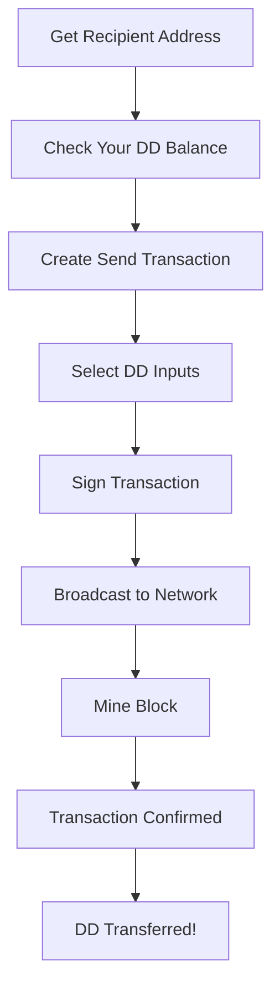

### Step-by-Step Sending Guide

#### Step 1: Get a Recipient DigiDollar Address

**Option A: Generate Address on Second Wallet**

```bash
# On a second terminal/node (simulating recipient)
./src/digibyte-cli -testnet -rpcwallet=recipient getdigidollaraddress "received_payment"
```

**Option B: Use Your Own Address (Self-Transfer)**

```bash
# Generate a second address in your wallet
RECIPIENT_ADDR=$(./src/digibyte-cli -testnet -rpcwallet=test getdigidollaraddress "savings")
echo "Recipient address: $RECIPIENT_ADDR"
```

**Address Format:**
- **TestNet:** Starts with `TD` (e.g., `TDtestaddress123456789abcdef`)
- **RegTest:** Starts with `RD`
- **Mainnet:** Starts with `DD`

#### Step 2: Validate the Address

```bash
# Validate recipient address
./src/digibyte-cli -testnet validateddaddress "$RECIPIENT_ADDR"
```

**Example Output:**
```json
{
  "isvalid": true,
  "address": "TDtestaddress123456789abcdef",
  "network": "testnet",
  "prefix": "TD",
  "ismine": false,
  "iswatchonly": false
}
```

#### Step 3: Check Your DD Balance

```bash
# Check available DD balance
./src/digibyte-cli -testnet -rpcwallet=test getdigidollarbalance
```

**Example Output:**
```json
{
  "confirmed": 10000,
  "unconfirmed": 0,
  "total": 10000
}
```

#### Step 4: Send DigiDollars

```bash
# Send $50 DD (5000 cents) to recipient
./src/digibyte-cli -testnet -rpcwallet=test senddigidollar "$RECIPIENT_ADDR" 5000
```

**Parameters:**
- `"$RECIPIENT_ADDR"` = Recipient DD address
- `5000` = Amount in DD cents ($50.00)

**Example Output:**
```json
{
  "txid": "fedcba0987654321fedcba0987654321fedcba0987654321fedcba0987654321",
  "to_address": "TDtestaddress123456789abcdef",
  "amount": 5000,
  "status": "success",
  "fee_paid": 0.001,
  "inputs_used": 1,
  "change_amount": 5000,
  "comment": ""
}
```

**Understanding:**
- `change_amount: 5000` - You had 10,000 DD, sent 5,000, kept 5,000 as change

#### Step 5: Confirm the Transaction

```bash
# Mine blocks to confirm
./src/digibyte-cli -testnet generatetoaddress 6 "$MINING_ADDRESS" 1000000 "scrypt"

# Check transaction status
./src/digibyte-cli -testnet gettransaction "fedcba0987654321fedcba0987654321fedcba0987654321fedcba0987654321"
```

#### Step 6: Verify Balances

**Your Balance:**
```bash
./src/digibyte-cli -testnet -rpcwallet=test getdigidollarbalance
```

**Expected:** 5000 DD cents ($50.00)

**Recipient Balance:**
```bash
./src/digibyte-cli -testnet -rpcwallet=recipient getdigidollarbalance
```

**Expected:** 5000 DD cents ($50.00)

---

### Sending Examples

#### Example 1: Send with Comment

```bash
# Send $25 with a comment
./src/digibyte-cli -testnet -rpcwallet=test senddigidollar "$RECIPIENT_ADDR" 2500 "Payment for services"

# View transaction
./src/digibyte-cli -testnet -rpcwallet=test listdigidollartxs | jq '.[0]'
```

#### Example 2: Send Multiple Times

```bash
# Send $10 three times
for i in {1..3}; do
    echo "Sending payment $i..."
    ./src/digibyte-cli -testnet -rpcwallet=test senddigidollar "$RECIPIENT_ADDR" 1000
    sleep 1
done

# Confirm all
./src/digibyte-cli -testnet generatetoaddress 6 "$MINING_ADDRESS" 1000000 "scrypt"

# View transaction history
./src/digibyte-cli -testnet -rpcwallet=test listdigidollartxs
```

#### Example 3: Send Everything (Maximum Amount)

```bash
# Get your total balance
TOTAL_DD=$(./src/digibyte-cli -testnet -rpcwallet=test getdigidollarbalance | jq .total)

# Send all DD (leave a bit for fees)
SEND_AMOUNT=$((TOTAL_DD - 10))
./src/digibyte-cli -testnet -rpcwallet=test senddigidollar "$RECIPIENT_ADDR" $SEND_AMOUNT
```

---

## 12. Receiving DigiDollars

### Receiving Flow Diagram

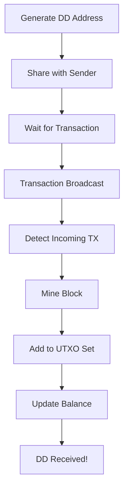

### Step-by-Step Receiving Guide

#### Step 1: Generate a Receiving Address

```bash
# Generate new DD address with label
RECEIVE_ADDR=$(./src/digibyte-cli -testnet -rpcwallet=test getdigidollaraddress "income")

# Display the address
echo "Your DigiDollar receiving address:"
echo "$RECEIVE_ADDR"

# Copy to clipboard (optional)
echo "$RECEIVE_ADDR" | xclip -selection clipboard  # Linux
echo "$RECEIVE_ADDR" | pbcopy                      # macOS
```

#### Step 2: Share Address with Sender

**Methods:**
1. Copy-paste the address text
2. Display as QR code (if GUI wallet)
3. Send via secure channel (email, messaging)

**Important:** Always verify the full address before sharing!

#### Step 3: Monitor Incoming Transactions

```bash
# Check your current balance
./src/digibyte-cli -testnet -rpcwallet=test getdigidollarbalance

# Watch for incoming transactions (run this in loop)
watch -n 5 './src/digibyte-cli -testnet -rpcwallet=test listdigidollartxs 5 | jq .[0]'
```

#### Step 4: Receive the Payment

**The sender executes:**
```bash
./src/digibyte-cli -testnet -rpcwallet=sender senddigidollar "$RECEIVE_ADDR" 5000
```

**You'll see:**
```json
{
  "txid": "1234567890abcdef1234567890abcdef1234567890abcdef1234567890abcdef",
  "category": "receive",
  "amount": 5000,
  "address": "TDyouraddress123456789abcdef",
  "confirmations": 0,
  "time": 1732204800,
  "comment": "Payment received"
}
```

#### Step 5: Wait for Confirmations

```bash
# Mine blocks to confirm (in testing)
./src/digibyte-cli -testnet generatetoaddress 6 "$MINING_ADDRESS" 1000000 "scrypt"

# Check confirmations
./src/digibyte-cli -testnet -rpcwallet=test listdigidollartxs | jq '.[0].confirmations'
```

**Confirmation Levels:**
- **0 confirmations** - In mempool, unconfirmed
- **1 confirmation** - In 1 block (15 seconds)
- **6 confirmations** - In 6 blocks (1.5 minutes) - **recommended minimum**

#### Step 6: Verify Receipt

```bash
# Check updated balance
./src/digibyte-cli -testnet -rpcwallet=test getdigidollarbalance
```

**Example Output:**
```json
{
  "confirmed": 5000,
  "unconfirmed": 0,
  "total": 5000
}
```

**Success!** You've received 5000 DD cents ($50.00)! 🎉

---

### Receiving Multiple Payments

```bash
# Generate multiple receiving addresses
for i in {1..5}; do
    ADDR=$(./src/digibyte-cli -testnet -rpcwallet=test getdigidollaraddress "receive_$i")
    echo "Address $i: $ADDR"
done

# List all your DD addresses
./src/digibyte-cli -testnet -rpcwallet=test listdigidollaraddresses
```

---

## 13. Redeeming from the Vault

### Redemption Flow Diagram

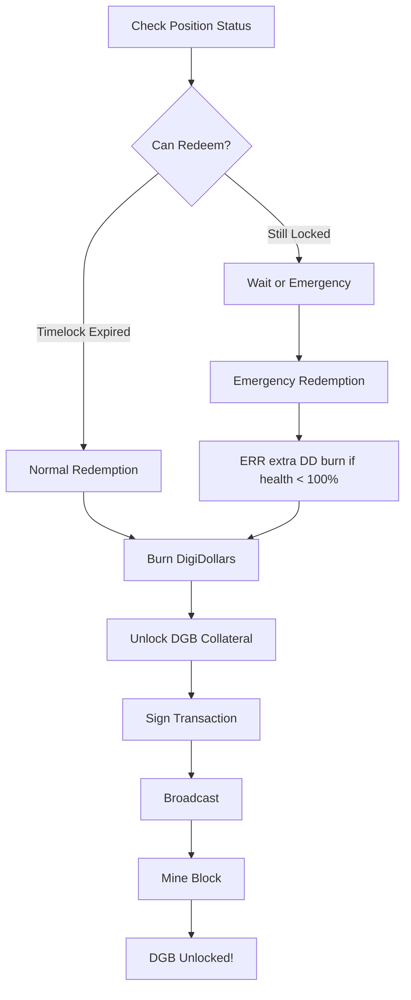

### Understanding Redemption

**What is Redemption?**

Redemption is the process of **burning DigiDollars to unlock your DGB collateral**. V1 uses full-vault redemption:

1. **Normal Redemption** - After timelock expires (most common)
2. **Emergency Redemption Ratio (ERR)** - After timelock expiry when system health is below 100%; the wallet burns the extra DD required by the ERR ratio and receives full collateral back

Partial redemption is not supported in V1.

### Step-by-Step Redemption Guide

#### Step 1: List Your Vault Positions

```bash
# View all your positions
./src/digibyte-cli -testnet -rpcwallet=test listdigidollarpositions
```

**Example Output:**
```json
[
  {
    "position_id": "abcdef1234567890abcdef1234567890abcdef1234567890abcdef1234567890",
    "dd_minted": 10000,
    "dgb_collateral": 6000.00000000,
    "lock_tier": 4,
    "unlock_height": 2103050,
    "blocks_remaining": 2102394,
    "status": "active",
    "can_redeem": false,
    "created_date": "2025-11-24T12:00:00Z",
    "unlock_date": "2026-11-24T12:00:00Z"
  }
]
```

**Key Fields:**
- `can_redeem: false` - Timelock not expired yet
- `blocks_remaining: 2102394` - Need to wait this many blocks
- `unlock_height: 2103050` - Block height when unlocked

#### Step 2: Fast-Forward Time (Testing Only)

**For testing, we can mine blocks to reach the unlock height.**

⚠️ **Warning:** This is 2,102,394 blocks! At 15 seconds/block, that's **366 days**. For testing, we'll use the **1-hour test tier** or mine rapidly.

**Use 1-Hour Test Lock (Tier 0):**

```bash
# Mint with 1-hour lock for testing redemption
./src/digibyte-cli -testnet -rpcwallet=test mintdigidollar 10000 0

# Confirm
./src/digibyte-cli -testnet generatetoaddress 6 "$MINING_ADDRESS" 1000000 "scrypt"

# Check position
./src/digibyte-cli -testnet -rpcwallet=test listdigidollarpositions
```

**Output:**
```json
{
  "position_id": "...",
  "lock_tier": 0,
  "unlock_height": 890,
  "blocks_remaining": 240,
  "can_redeem": false
}
```

**Mine 240 blocks (~1 hour worth):**

```bash
# Mine to unlock height
./src/digibyte-cli -testnet generatetoaddress 240 "$MINING_ADDRESS" 1000000 "scrypt"

# Check if now redeemable
./src/digibyte-cli -testnet -rpcwallet=test listdigidollarpositions | jq '.[0].can_redeem'
# Should show: true
```

#### Step 3: Execute Redemption

```bash
# Get the position ID
POSITION_ID=$(./src/digibyte-cli -testnet -rpcwallet=test listdigidollarpositions | jq -r '.[0].position_id')

# Redeem $50 (partial redemption)
./src/digibyte-cli -testnet -rpcwallet=test redeemdigidollar "$POSITION_ID" 5000
```

**Parameters:**
- `"$POSITION_ID"` = Position ID (64-character hex hash)
- `5000` = Amount of DD to redeem ($50.00)

**Example Output:**
```json
{
  "txid": "fedcba0987654321fedcba0987654321fedcba0987654321fedcba0987654321",
  "position_id": "abcdef1234567890abcdef1234567890abcdef1234567890abcdef1234567890",
  "dd_redeemed": 5000,
  "dgb_unlocked": 3000.00000000,
  "unlock_address": "dgbt1qw508d6qejxtdg4y5r3zarvary0c5xw7kv8f3t4",
  "fee_paid": 0.001,
  "redemption_path": "normal",
  "position_closed": false
}
```

**Understanding:**
- Redeemed $50 DD (5000 cents)
- Unlocked 3,000 DGB (50% of collateral)
- Position still active with remaining 5000 DD and 3,000 DGB

#### Step 4: Confirm Redemption

```bash
# Mine blocks to confirm
./src/digibyte-cli -testnet generatetoaddress 6 "$MINING_ADDRESS" 1000000 "scrypt"

# Check transaction
./src/digibyte-cli -testnet gettransaction "fedcba0987654321fedcba0987654321fedcba0987654321fedcba0987654321"
```

#### Step 5: Verify Balances

**DD Balance:**
```bash
./src/digibyte-cli -testnet -rpcwallet=test getdigidollarbalance
```

**Expected:** Reduced by 5000 DD (burned)

**DGB Balance:**
```bash
./src/digibyte-cli -testnet -rpcwallet=test getbalance
```

**Expected:** Increased by 3,000 DGB (unlocked)

**Position Status:**
```bash
./src/digibyte-cli -testnet -rpcwallet=test listdigidollarpositions
```

**Expected:** Position still active with 5000 DD and 3,000 DGB remaining

---

### Redemption Examples

#### Example 1: Full Redemption (Close Position)

```bash
# Get position info
POSITION=$(./src/digibyte-cli -testnet -rpcwallet=test listdigidollarpositions | jq '.[0]')
POSITION_ID=$(echo "$POSITION" | jq -r '.position_id')
DD_MINTED=$(echo "$POSITION" | jq -r '.dd_minted')

# Redeem all DD (closes position)
./src/digibyte-cli -testnet -rpcwallet=test redeemdigidollar "$POSITION_ID" $DD_MINTED

# Confirm
./src/digibyte-cli -testnet generatetoaddress 6 "$MINING_ADDRESS" 1000000 "scrypt"

# Verify position is closed
./src/digibyte-cli -testnet -rpcwallet=test listdigidollarpositions | jq '.[0].status'
# Should show: "redeemed"
```

#### Example 2: Multiple Partial Redemptions

```bash
# Redeem in three parts
POSITION_ID="abcdef..."

# Redeem 25% ($25)
./src/digibyte-cli -testnet -rpcwallet=test redeemdigidollar "$POSITION_ID" 2500
./src/digibyte-cli -testnet generatetoaddress 6 "$MINING_ADDRESS" 1000000 "scrypt"

# Redeem another 25% ($25)
./src/digibyte-cli -testnet -rpcwallet=test redeemdigidollar "$POSITION_ID" 2500
./src/digibyte-cli -testnet generatetoaddress 6 "$MINING_ADDRESS" 1000000 "scrypt"

# Redeem final 50% ($50)
./src/digibyte-cli -testnet -rpcwallet=test redeemdigidollar "$POSITION_ID" 5000
./src/digibyte-cli -testnet generatetoaddress 6 "$MINING_ADDRESS" 1000000 "scrypt"

# Position is now fully redeemed
```

#### Example 3: Redemption to Specific Address

```bash
# Generate a new DGB address for receiving unlocked collateral
UNLOCK_ADDR=$(./src/digibyte-cli -testnet -rpcwallet=test getnewaddress "unlocked_collateral")

# Redeem with specific unlock address
./src/digibyte-cli -testnet -rpcwallet=test redeemdigidollar "$POSITION_ID" 10000 "$UNLOCK_ADDR"

# Confirm
./src/digibyte-cli -testnet generatetoaddress 6 "$MINING_ADDRESS" 1000000 "scrypt"

# Verify DGB received at specific address
./src/digibyte-cli -testnet -rpcwallet=test getreceivedbyaddress "$UNLOCK_ADDR"
```

---

# Part V: Advanced Topics

## 14. Using the QT GUI Wallet

### QT Wallet Overview

The DigiDollar QT wallet provides a **user-friendly graphical interface** for all DigiDollar operations. No command-line needed!

### DigiDollar Tab Structure

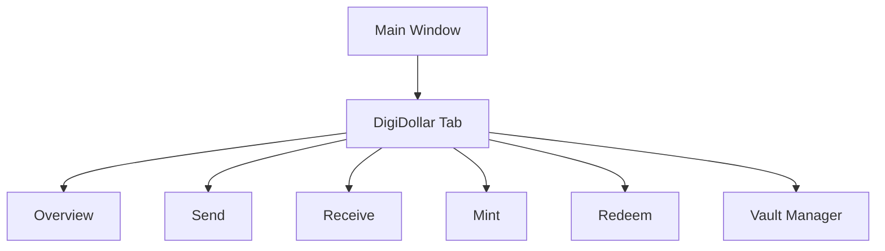

### Starting the QT Wallet

```bash
# Start QT wallet in TestNet mode
./src/qt/digibyte-qt -testnet
```

**First Launch:**
1. Splash screen appears
2. Creates data directory
3. Syncs blockchain (shows progress)
4. Main window opens

### Tab 1: Overview

**Location:** DigiDollar → Overview

**What You'll See:**
- **Network Stats** - Total DD supply, system health
- **Your Balance** - DD balance, DGB collateral locked
- **Oracle Price** - Current DGB/USD price
- **Recent Transactions** - Last 10 DD transactions
- **System Status** - DCA multiplier, protection systems

**Key Indicators:**
- 🟢 Green - System healthy (>150% collateralized)
- 🟡 Yellow - Warning (120-150% collateralized)
- 🔴 Red - Critical (<120% collateralized)

### Tab 2: Send

**Location:** DigiDollar → Send

**Steps:**
1. **Enter Recipient Address** - Paste DD/TD/RD address
2. **Enter Amount** - Type amount in DD (e.g., 50.00)
3. **Add Label** (optional) - Add description
4. **Review Fee** - Shows estimated fee
5. **Click Send** - Confirms and broadcasts

**Features:**
- Address validation (red border if invalid)
- Balance checking (prevents overspending)
- QR code scanner (scan recipient's QR)
- Address book integration

### Tab 3: Receive

**Location:** DigiDollar → Receive

**Steps:**
1. **Click "Request Payment"**
2. **Enter Amount** (optional) - Specify amount to request
3. **Add Message** (optional) - Add description
4. **QR Code Displays** - Shows your DD address as QR
5. **Share Address** - Copy button, or let sender scan QR

**Features:**
- Multiple address generation
- QR code display (for mobile wallets)
- Address labeling
- Request history

### Tab 4: Mint

**Location:** DigiDollar → Mint

**Interface Elements:**

```
┌─────────────────────────────────────────────┐
│              MINT DIGIDOLLARS               │
├─────────────────────────────────────────────┤
│ Amount to Mint (USD):                       │
│ ┌──────────────────┐                        │
│ │ $ 100.00         │                        │
│ └──────────────────┘                        │
│                                             │
│ Lock Period:                                │
│ ┌──────────────────────────────────────┐   │
│ │ ▼ 1 Year (300% collateral)           │   │
│ └──────────────────────────────────────┘   │
│                                             │
│ Oracle Price: $0.05 per DGB                 │
│ Required Collateral: 6,000.00 DGB           │
│ Effective Ratio: 300% (Healthy)            │
│                                             │
│ ┌─────────────────────────────────────┐    │
│ │      [MINT DIGIDOLLARS]             │    │
│ └─────────────────────────────────────┘    │
└─────────────────────────────────────────────┘
```

**Steps:**
1. **Enter Amount** - Type amount in USD
2. **Select Lock Period** - Choose from dropdown (1h to 10y)
3. **Review Collateral** - See required DGB amount
4. **Click "Mint DigiDollars"** - Executes mint
5. **Confirm Transaction** - Shows summary, confirm

**Real-Time Updates:**
- Collateral auto-calculates as you type
- Oracle price updates every block
- Health indicator shows system status

### Tab 5: Redeem

**Location:** DigiDollar → Redeem

**Interface Elements:**

```
┌─────────────────────────────────────────────┐
│            REDEEM DIGIDOLLARS               │
├─────────────────────────────────────────────┤
│ Select Position:                            │
│ ┌──────────────────────────────────────┐   │
│ │ ▼ Position 1: $100.00 (6,000 DGB)   │   │
│ └──────────────────────────────────────┘   │
│                                             │
│ Position Details:                           │
│ • DD Minted: 10,000 cents ($100.00)        │
│ • DGB Locked: 6,000.00                     │
│ • Lock Tier: 1 Year                        │
│ • Blocks Remaining: 2,102,394               │
│ • Can Redeem: No (locked)                  │
│ • Health: 300% (Healthy)                   │
│                                             │
│ Amount to Redeem:                           │
│ ┌──────────────────┐                        │
│ │ $ 50.00          │   ┌──────────────┐    │
│ └──────────────────┘   │ [REDEEM ALL] │    │
│                         └──────────────┘    │
│                                             │
│ ┌─────────────────────────────────────┐    │
│ │      [REDEEM DIGIDOLLARS]           │    │
│ └─────────────────────────────────────┘    │
└─────────────────────────────────────────────┘
```

**Steps:**
1. **Select Position** - Choose from dropdown
2. **Enter Amount** - Type DD amount to redeem
3. **Review Unlock** - See DGB amount that will unlock
4. **Click "Redeem DigiDollars"** - Executes redemption
5. **Confirm Transaction** - Shows summary, confirm

**Features:**
- Position dropdown (all active vaults)
- Partial redemption support
- "Redeem All" button (closes position)
- Time remaining countdown
- Health status indicator

### Tab 6: Vault Manager

**Location:** DigiDollar → Vault Manager

**Table Columns:**
| Position ID | DD Amount | DGB Locked | Lock Tier | Unlock Height | Status | Health | Actions |
|-------------|-----------|------------|-----------|---------------|--------|--------|---------|
| abcdef... | $100.00 | 6,000 | 1 Year | 2,103,050 | Active | 300% | [Details] |

**Features:**
- Sortable columns (click headers)
- Filter by status (active/unlocked/redeemed)
- Filter by tier
- Search by position ID
- Right-click context menu:
  - View Details
  - Redeem Position
  - Copy Position ID
- Double-click position → Opens in Redeem tab

---

## 15. Command Line Reference

### Quick Command Index

| Task | Command |
|------|---------|
| **System Info** | |
| Check blockchain info | `digibyte-cli -testnet getblockchaininfo` |
| Check DigiDollar stats | `digibyte-cli -testnet getdigidollarstats` |
| Get oracle price | `digibyte-cli -testnet getoracleprice` |
| Get DCA multiplier | `digibyte-cli -testnet getdcamultiplier` |
| **Minting** | |
| Calculate collateral | `digibyte-cli -testnet calculatecollateralrequirement <dd_cents> <days>` |
| Mint DigiDollars | `digibyte-cli -testnet -rpcwallet=test mintdigidollar <dd_cents> <tier>` |
| **Transactions** | |
| Send DigiDollars | `digibyte-cli -testnet -rpcwallet=test senddigidollar <address> <dd_cents>` |
| Redeem DigiDollars | `digibyte-cli -testnet -rpcwallet=test redeemdigidollar <position_id> <dd_cents>` |
| **Balances** | |
| Get DD balance | `digibyte-cli -testnet -rpcwallet=test getdigidollarbalance` |
| Get DGB balance | `digibyte-cli -testnet -rpcwallet=test getbalance` |
| **Addresses** | |
| Generate DD address | `digibyte-cli -testnet -rpcwallet=test getdigidollaraddress [label]` |
| Validate DD address | `digibyte-cli -testnet validateddaddress <address>` |
| **Positions** | |
| List positions | `digibyte-cli -testnet -rpcwallet=test listdigidollarpositions` |
| List transactions | `digibyte-cli -testnet -rpcwallet=test listdigidollartxs` |
| **Mining** | |
| Generate blocks | `digibyte-cli -testnet generatetoaddress <nblocks> <address> <maxtries> <algo>` |
| Get mining info | `digibyte-cli -testnet getmininginfo` |

### Complete RPC Command Reference

See full documentation in Part IV, Section 15 of this guide.

---

## 16. Troubleshooting

### Common Issues and Solutions

<details>
<summary><b>⚠️ Error: "Could not connect to the server"</b></summary>

**Symptoms:**
```
error: Could not connect to the server 127.0.0.1:14026

Make sure the digibyted server is running and that you are connecting to the correct RPC port.
```

**Causes:**
- Daemon not running
- Wrong RPC port
- Wrong network (mainnet vs testnet)

**Solutions:**

1. **Start the daemon:**
```bash
./src/digibyted -testnet -daemon
sleep 5  # Wait for startup
```

2. **Check if running:**
```bash
ps aux | grep digibyted
```

3. **Verify port:**
```bash
grep rpcport ~/.digibyte/digibyte.conf
# Should show: rpcport=14026
```

4. **Check debug.log:**
```bash
tail -f ~/.digibyte/testnet26/debug.log
```

</details>

<details>
<summary><b>⚠️ Error: "Insufficient funds"</b></summary>

**Symptoms:**
```
error: {"code":-6,"message":"Insufficient funds"}
```

**Causes:**
- Not enough DGB for collateral
- Not enough DD for sending/redeeming
- Funds not confirmed (0 confirmations)

**Solutions:**

1. **Check DGB balance:**
```bash
./src/digibyte-cli -testnet -rpcwallet=test getbalance
```

2. **Mine more blocks (if testing):**
```bash
ADDR=$(./src/digibyte-cli -testnet -rpcwallet=test getnewaddress)
./src/digibyte-cli -testnet generatetoaddress 100 "$ADDR" 1000000 "scrypt"
```

3. **Check DD balance:**
```bash
./src/digibyte-cli -testnet -rpcwallet=test getdigidollarbalance
```

4. **Wait for confirmations:**
```bash
./src/digibyte-cli -testnet generatetoaddress 6 "$ADDR" 1000000 "scrypt"
```

</details>

<details>
<summary><b>⚠️ Error: "DigiDollar not active"</b></summary>

**Symptoms:**
```
error: {"code":-1,"message":"DigiDollar not active at current height"}
```

**Cause:**
- Current block height is below 650 (activation height)

**Solution:**

1. **Check current height:**
```bash
./src/digibyte-cli -testnet getblockcount
```

2. **Mine to activation:**
```bash
HEIGHT=$(./src/digibyte-cli -testnet getblockcount)
NEEDED=$((650 - HEIGHT))
echo "Need to mine $NEEDED more blocks"

ADDR=$(./src/digibyte-cli -testnet -rpcwallet=test getnewaddress)
./src/digibyte-cli -testnet generatetoaddress $NEEDED "$ADDR" 1000000 "scrypt"
```

</details>

<details>
<summary><b>⚠️ Error: "Position cannot be redeemed yet"</b></summary>

**Symptoms:**
```
error: {"code":-1,"message":"Position cannot be redeemed yet (timelock not expired)"}
```

**Cause:**
- Trying to redeem before unlock_height

**Solutions:**

1. **Check position status:**
```bash
./src/digibyte-cli -testnet -rpcwallet=test listdigidollarpositions | jq '.[0] | {unlock_height, blocks_remaining, can_redeem}'
```

2. **For testing, mine to unlock height:**
```bash
UNLOCK_HEIGHT=$(./src/digibyte-cli -testnet -rpcwallet=test listdigidollarpositions | jq '.[0].unlock_height')
CURRENT=$(./src/digibyte-cli -testnet getblockcount)
NEEDED=$((UNLOCK_HEIGHT - CURRENT))

echo "Mining $NEEDED blocks to unlock..."
ADDR=$(./src/digibyte-cli -testnet -rpcwallet=test getnewaddress)
./src/digibyte-cli -testnet generatetoaddress $NEEDED "$ADDR" 1000000 "scrypt"
```

3. **Or wait for real time to pass (production)**

</details>

<details>
<summary><b>⚠️ Error: "Invalid DigiDollar address"</b></summary>

**Symptoms:**
```
error: {"code":-5,"message":"Invalid DigiDollar address"}
```

**Causes:**
- Wrong address format (should start with DD/TD/RD)
- Typo in address
- Using wrong network (mainnet address on testnet)

**Solutions:**

1. **Validate address:**
```bash
./src/digibyte-cli -testnet validateddaddress "TDyouraddress..."
```

2. **Check prefix:**
- TestNet: Must start with `TD`
- RegTest: Must start with `RD`
- Mainnet: Must start with `DD`

3. **Generate new address:**
```bash
./src/digibyte-cli -testnet -rpcwallet=test getdigidollaraddress
```

</details>

<details>
<summary><b>⚠️ Error: "Oracle price not available"</b></summary>

**Symptoms:**
```
error: {"code":-1,"message":"Oracle price not available"}
```

**Causes:**
- Below testnet26 activation height (600)
- No oracle bundle in recent blocks
- On regtest only: mock oracle not set

**Solutions:**

1. **Check height:**
```bash
./src/digibyte-cli -testnet getblockcount
# Must be >= 600
```

2. **Verify live oracle price:**
```bash
./src/digibyte-cli -testnet getoracleprice
```

3. **Mine blocks to trigger oracle:**
```bash
ADDR=$(./src/digibyte-cli -testnet -rpcwallet=test getnewaddress)
./src/digibyte-cli -testnet generatetoaddress 10 "$ADDR" 1000000 "scrypt"
```

</details>

---

### Debug Log Locations

**Linux:**
```bash
tail -f ~/.digibyte/testnet26/debug.log
```

**macOS:**
```bash
tail -f ~/Library/Application\ Support/DigiByte/testnet26/debug.log
```

**Filtering for DigiDollar:**
```bash
tail -f ~/.digibyte/testnet26/debug.log | grep -i digidollar
```

**Filtering for Oracle:**
```bash
tail -f ~/.digibyte/testnet26/debug.log | grep -i oracle
```

---

### Getting Help

**Command Line Help:**
```bash
# General help
./src/digibyte-cli -testnet help

# Help for specific command
./src/digibyte-cli -testnet help getdigidollarstats
./src/digibyte-cli -testnet help mintdigidollar
```

**Online Resources:**
- **GitHub Discussions:** https://github.com/orgs/DigiByte-Core/discussions
- **DigiDollar White Paper:** https://github.com/orgs/DigiByte-Core/discussions/319
- **DigiDollar Tech Specs:** https://github.com/orgs/DigiByte-Core/discussions/324

---

## 17. Additional Resources

### Documentation Files

| File | Location | Purpose |
|------|----------|---------|
| **DIGIDOLLAR_EXPLAINER.md** | `/home/jared/Code/digibyte/` | User-friendly overview |
| **DIGIDOLLAR_ARCHITECTURE.md** | `/home/jared/Code/digibyte/` | Technical implementation (82% complete) |
| **DIGIDOLLAR_ORACLE_ARCHITECTURE.md** | `/home/jared/Code/digibyte/` | Oracle system details (100% complete) |
| **build-unix.md** | `/home/jared/Code/digibyte/doc/` | Linux/Unix build guide |
| **build-osx.md** | `/home/jared/Code/digibyte/doc/` | macOS build guide |
| **build-windows.md** | `/home/jared/Code/digibyte/doc/` | Windows build guide |
| **TESTNET_RESET_GUIDE.md** | `/home/jared/Code/digibyte/doc/` | TestNet reset documentation |

### Functional Tests

Run these to see working examples:

```bash
cd ~/Code/digibyte

# Basic DigiDollar test
test/functional/digidollar_basic.py

# Minting test
test/functional/digidollar_mint.py

# Transfer test
test/functional/digidollar_transfer.py

# Redemption test
test/functional/digidollar_redeem.py

# Oracle integration test
test/functional/digidollar_oracle.py

# Network tracking test
test/functional/digidollar_network_tracking.py

# Complete test suite
test/functional/test_runner.py --extended
```

### Understanding the Architecture

**Key Components:**

1. **Core DigiDollar Logic:**
   - `/src/digidollar/digidollar.cpp` - Main DigiDollar class
   - `/src/digidollar/txbuilder.cpp` - Transaction building
   - `/src/digidollar/validation.cpp` - Transaction validation

2. **Oracle System:**
   - `/src/oracle/bundle_manager.cpp` - Oracle bundle aggregation
   - `/src/oracle/exchange.cpp` - Exchange API integration
   - `/src/primitives/oracle.cpp` - Oracle data structures

3. **Protection Systems:**
   - `/src/consensus/dca.cpp` - Dynamic Collateral Adjustment
   - `/src/consensus/err.cpp` - Emergency Redemption Ratio
   - `/src/consensus/volatility.cpp` - Volatility protection

4. **RPC Interface:**
   - `/src/rpc/digidollar.cpp` - All DigiDollar RPC commands

5. **QT GUI:**
   - `/src/qt/digidollartab.cpp` - Main tab interface
   - `/src/qt/digidollarmintwidget.cpp` - Mint UI
   - `/src/qt/digidollarsendwidget.cpp` - Send UI
   - `/src/qt/digidollarredeemwidget.cpp` - Redeem UI

### Community Resources

- **DigiByte Core GitHub:** https://github.com/digibyte-core/digibyte
- **DigiDollar Discussions:** https://github.com/orgs/DigiByte-Core/discussions/319
- **50 DigiDollar Use Cases:** https://github.com/orgs/DigiByte-Core/discussions/325

---

## Congratulations! 🎉

You've completed the DigiDollar TestNet Beginner's Guide!

You now know how to:
- ✅ Compile the DigiByte wallet from source
- ✅ Run a TestNet node and mine blocks
- ✅ Mint DigiDollars by locking DGB collateral
- ✅ Send and receive DigiDollars
- ✅ Redeem DigiDollars and unlock your DGB
- ✅ Use both the QT GUI and command line
- ✅ Understand the Oracle price system
- ✅ Troubleshoot common issues

### Next Steps

1. **Experiment Further:**
   - Try different lock tiers
   - Test partial redemptions
   - Simulate price volatility
   - Run functional tests

2. **Dive Deeper:**
   - Read the technical architecture docs
   - Explore the source code
   - Run the full test suite
   - Contribute to development

3. **Join the Community:**
   - Participate in GitHub discussions
   - Report bugs or issues
   - Suggest improvements
   - Help other testers

### Thank You for Testing DigiDollar!

Your testing helps make DigiDollar better for everyone. 🚀

---

**Document Version:** 1.0
**Last Updated:** 2025-11-24
**Status:** Complete
**Feedback:** https://github.com/digibyte-core/digibyte/issues

---

**DigiDollar:** *The world's first truly decentralized stablecoin on a UTXO blockchain, where you keep control of your private keys.*
