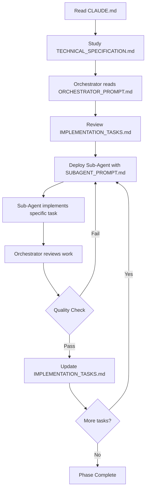

# DigiDollar Implementation Guide

## Overview

This directory contains the complete implementation plan for DigiDollar, a fully decentralized USD-pegged stablecoin for DigiByte v8.26. The system has been meticulously designed to provide a robust, secure, and scalable stablecoin solution using time-locked DGB collateral and decentralized price oracles.

## Documentation Structure

### 1. **TECHNICAL_SPECIFICATION.md**
The complete technical blueprint containing:
- Detailed system architecture
- Core data structures and algorithms
- Transaction implementation details
- Oracle system design
- Protection mechanisms (DCA, ERR, volatility)
- Wallet integration specifications
- Testing strategies
- Security considerations

### 2. **ORCHESTRATOR_PROMPT.md**
Instructions for the AI orchestrator agent that will manage the implementation:
- Project management responsibilities
- Sub-agent deployment strategy
- Quality control standards
- Phase-based implementation approach
- Error recovery procedures

### 3. **SUBAGENT_PROMPT.md**
Template for individual implementation agents:
- Coding standards and conventions
- Testing requirements
- Documentation standards
- Common implementation patterns
- Debugging strategies

### 4. **IMPLEMENTATION_TASKS.md**
Comprehensive task list with 70+ specific tasks organized in 7 phases:
- Phase 1: Foundation (Core structures, opcodes)
- Phase 2: Oracle System (Price feeds, consensus)
- Phase 3: Transaction Types (Mint, transfer, redeem)
- Phase 4: Protection Systems (DCA, ERR, volatility)
- Phase 5: Wallet Integration (GUI, RPC)
- Phase 6: Testing & Hardening
- Phase 7: Final Integration & Launch

## Key Technical Innovations

### Multi-Tier Collateral System
- **10 canonical lock periods**: 1 hour to 10 years
- **Treasury-model ratios**: 1000% (1 hour) down to 200% (10 years)
- **Rewards patience**: Longer commitments = better efficiency

### Four-Layer Protection System
1. **Higher Base Collateral**: 1000%-200% ratios provide substantial buffer
2. **Dynamic Collateral Adjustment (DCA)**: Increases requirements during stress
3. **Emergency Redemption Ratio (ERR)**: Adjusts redemption requirements when undercollateralized
4. **Market Dynamics**: DGB becomes strategic reserve asset

### Taproot Enhancement
- **P2TR outputs**: All DigiDollar transactions use Taproot
- **MAST redemption paths**: Multiple spending conditions
- **Enhanced privacy**: Transactions indistinguishable on-chain
- **Efficiency**: 30-50% smaller transactions

### Decentralized Oracle System
- **30 hardcoded nodes**: Similar to DNS seeders
- **8-of-15 consensus**: Requires majority agreement
- **Schnorr signatures**: Efficient batch verification
- **Deterministic selection**: Fair rotation every 100 blocks

## Implementation Strategy

### Getting Started

1. **For Project Managers/Orchestrators**:
   - Read `ORCHESTRATOR_PROMPT.md` first
   - Review `TECHNICAL_SPECIFICATION.md` thoroughly
   - Use `IMPLEMENTATION_TASKS.md` to track progress
   - Deploy sub-agents one at a time using `SUBAGENT_PROMPT.md`

2. **For Developers/Sub-Agents**:
   - Read `SUBAGENT_PROMPT.md` for your role
   - Reference `TECHNICAL_SPECIFICATION.md` for details
   - Check `IMPLEMENTATION_TASKS.md` for your specific task
   - Follow DigiByte v8.26 coding conventions

3. **For Reviewers**:
   - Use `TECHNICAL_SPECIFICATION.md` as the source of truth
   - Verify implementations against specifications
   - Ensure all protection mechanisms are properly implemented
   - Check test coverage and security considerations

### Execution Flow



## Critical Implementation Notes

### DigiByte-Specific Constants
```cpp
// These MUST be used instead of Bitcoin defaults
BLOCK_TIME = 15 seconds (NOT 600)
COINBASE_MATURITY = 8 blocks (NOT 100)
MAX_SUPPLY = 21 billion DGB (NOT 21 million)
FEES in KvB (NOT vB) - multiply by 1000
```

### Consensus Changes
- New opcodes use OP_NOP slots for soft fork compatibility
- Transaction version includes DD marker: `0x0D1D0770`
- All changes must be backward compatible

### Testing Requirements
- Unit tests for every function
- Integration tests for all workflows
- Regtest validation before testnet
- 80%+ code coverage target

## System Capabilities

When fully implemented, DigiDollar will provide:

1. **Stable Value**: 1 DigiDollar = 1 USD always
2. **Decentralized**: No central authority or custodian
3. **Secure**: Multiple protection layers against volatility
4. **Efficient**: Taproot enables smaller, cheaper transactions
5. **Private**: Enhanced privacy through P2TR outputs
6. **Flexible**: Multiple collateral tiers for different needs
7. **Resilient**: Survives 50%+ price drops (up to 80% for 30-day locks)

## Risk Mitigation

### Technical Risks
- **Consensus bugs**: Extensive testing on regtest/testnet
- **Oracle failures**: Multiple sources, fallback mechanisms
- **Script vulnerabilities**: Formal verification, audits

### Economic Risks
- **Bank runs**: ERR mechanism, time locks
- **Price volatility**: DCA, high collateral ratios
- **Liquidity crises**: Reserve dynamics, market incentives

### Operational Risks
- **Oracle coordination**: Hardcoded nodes, reputation system
- **Network attacks**: Standard DigiByte security model
- **Upgrade failures**: Soft fork with BIP9 activation

## Success Criteria

The implementation is considered successful when:

1. ✅ All 70+ tasks in IMPLEMENTATION_TASKS.md complete
2. ✅ Comprehensive test suite passing
3. ✅ Security audit completed with no critical issues
4. ✅ 30-day testnet stability demonstrated
5. ✅ Community consensus achieved
6. ✅ Mainnet activation successful

## Timeline

**Estimated Timeline**: 28 weeks (7 months)
- Phases 1-3: Core implementation (12 weeks)
- Phases 4-5: Protection & wallet (8 weeks)
- Phases 6-7: Testing & deployment (8 weeks)

## Next Steps

1. **Immediate Actions**:
   - Set up development environment
   - Create `src/digidollar/` directory structure
   - Begin Phase 1 foundation tasks

2. **First Milestone** (Week 4):
   - Core data structures complete
   - Basic script system functional
   - Unit test framework established

3. **Key Milestone** (Week 16):
   - All transaction types working
   - Protection systems active
   - Ready for intensive testing

## Support and Resources

- **DigiByte Core Docs**: Reference for existing codebase
- **Bitcoin Core Developer Docs**: Many concepts translate directly
- **Taproot BIPs**: BIP340, BIP341, BIP342 for implementation details
- **Test Networks**: Use regtest first, then testnet

## Conclusion

DigiDollar represents a major advancement for DigiByte, bringing stable value transactions to the ecosystem while maintaining the principles of decentralization and security. This implementation plan provides a clear, methodical path from concept to production-ready code.

The multi-tier collateral system with four-layer protection ensures DigiDollar can withstand extreme market conditions while providing users flexibility in how they participate. By leveraging Taproot and modern cryptographic techniques, the system achieves privacy and efficiency not possible in earlier designs.

Begin implementation by having the orchestrator read all documentation and deploy the first sub-agent to create the foundation infrastructure. Build systematically, test thoroughly, and maintain quality at every step.

**The path to a decentralized stablecoin for DigiByte starts here.**
